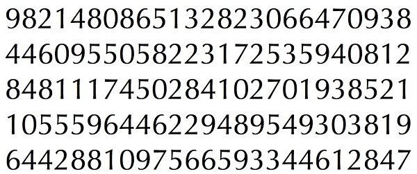
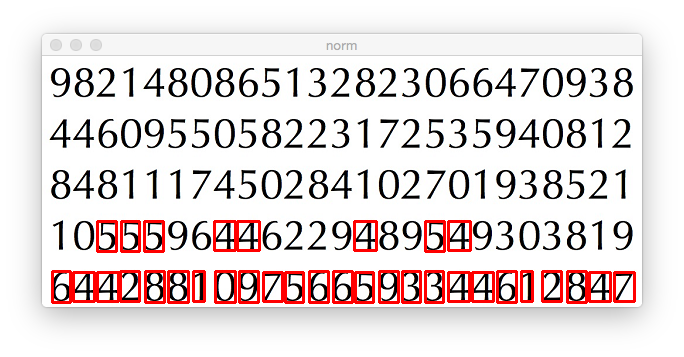
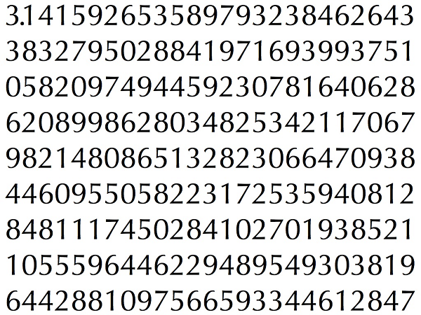
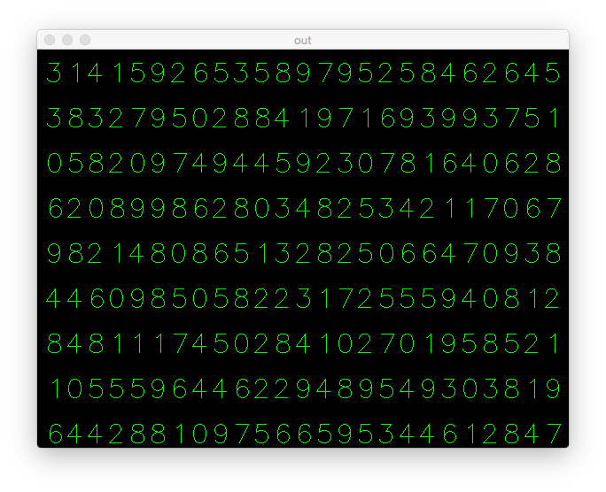

tereconozco
===========
"... como borroso diario - Estopa"

Digit recognition with OpenCV.
Based on Machine Learning.

# Training

    python training.py

Prepare the data for training, small code in OpenCV. It does following things:

a) Loads the image.

b) Selects the digits ( obviously by contour finding and applying constraints on area and height of letters to avoid false detections).
c) Draws the bounding rectangle around one letter and wait for key press. This time we press the digit key corresponding to the letter in box.

d) Once corresponding digit key is pressed, it resizes this box to 10x10 and saves 100 pixel values in an array (here, samples) and corresponding manually entered digit in another array (here, responses).
e) Then save both the arrays in seperate txt files.

# Training & Testing

    python testing.py

# Training

a) Load the txt files we already saved earlier
b) Create a instance of classifier we are using ( here, it is KNearest)
c) Then we use KNearest.train function to train the data

# Testing

a) Load the image used for testing

b) Process the image as earlier and extract each digit using contour methods
c) Draw bounding box for it, then resize to 10x10, and store its pixel values in an array as done earlier.
d) Then we use KNearest.find_nearest() function to find the nearest item to the one we gave. ( If lucky, it recognises the correct digit.)

